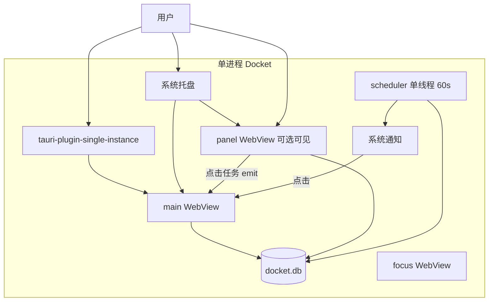

# Docket 桌面常驻与悬浮任务面板 — 设计说明

**日期：** 2026-05-19  
**状态：** 已批准（待实现计划）  
**平台优先级：** Windows 10/11；macOS 为 v2  

---

## 1. 背景与目标

Docket 是本地优先的 Tauri v2 + Solid.js + SQLite 任务应用。在已有主窗口、专注小窗、系统托盘与本地提醒的基础上，新增三类能力，并统一满足 **低负载（老机器友好）** 与 **严格数据安全（可选联网、无应用内导出）**。

### 1.1 功能目标

| # | 能力 | 用户期望 |
|---|------|----------|
| F1 | **单例运行** | 同一时间仅一个进程；再次启动应唤起已有实例 |
| F2 | **后台常驻** | 主窗口关闭（×）隐藏到托盘，进程继续；托盘「退出」才真正结束 |
| F3 | **桌面任务面板** | 独立悬浮小窗：只读展示今日 + 逾期/未完成；点击条目打开主窗口并定位任务 |
| F4 | **Windows 系统通知** | 本地通知：任务提醒（已有）+ 每日摘要 + 逾期提醒；点击打开主窗口 |
| NFR1 | **低负载** | 事件驱动刷新；panel 隐藏时不常驻重 WebView；克制定时器 |
| NFR2 | **数据安全** | 无应用内数据导出；默认零出站；节假日同步为 **S2 可选联网** |

### 1.2 已确认的产品选择

- 桌面面板形态：**A** — 独立 Tauri 悬浮小窗（非 Widgets / 壁纸层）
- 主窗口 ×：**A** — 隐藏到托盘（不退出）
- 面板交互：**A** — 只读；点击 → 主窗 `show` + `selectTask`
- 联网策略：**S2** — `fetch_holidays_online` 保留，**默认关闭**；用户手动同步时弹窗说明访问 `timor.tech`

### 1.3 明确不做（YAGNI）

- 应用内 JSON/CSV 导入导出（已移除，保持移除）
- 面板内完成任务、新建、改期
- 云同步、自动更新检查、遥测上报
- macOS 悬浮 panel 与通知细节（v2）
- v1 SQLCipher 全库加密（与低负载冲突，单独立项）

---

## 2. 现状（实现基线）

- **托盘：** `TrayIconBuilder` + 显示窗口 / 今日任务 / 快速添加 / 退出
- **通知：** `tauri-plugin-notification` + `scheduler.rs` 60s 轮询未处理提醒
- **窗口：** `main`、`focus`；无 `panel`、无单例、主窗关闭即退出应用
- **数据：** `list_tasks` 等 IPC；无 `get_desktop_panel_snapshot`

---

## 3. 架构概览



### 3.1 窗口模型

| 标签 | 用途 | v1 行为 |
|------|------|---------|
| `main` | 主应用 | × → `hide`；托盘/单例/通知 → `show` + `set_focus` |
| `focus` | 专注计时 | 不变 |
| `panel` | 桌面任务面板 | 独立生命周期；`skipTaskbar: true`；托盘可显示/隐藏 |

主窗隐藏 **不强制** 关闭 panel（托盘控制 panel 可见性）。

### 3.2 单例（F1）

**方案：** `tauri-plugin-single-instance`（Win/macOS/Linux 一致，便于 v2）。

二次启动回调：

1. `get_webview_window("main")`
2. `show()`（若已 hide）
3. `set_focus()`
4. 可选：系统通知或托盘 balloon「Docket 已在运行」

插件注册在 `Builder` 链最前（desktop only）。

### 3.3 后台常驻（F2）

**方案：** 拦截主窗 `CloseRequested` → `prevent_close` + `hide()`。

- 托盘「退出」：`app.exit(0)`（唯一正常退出路径）
- 开发文档：`tauri dev` 仍可能热重载起多进程，生产包为单例

可选 v1.1：设置「启动时最小化到托盘」。

### 3.4 桌面面板（F3）

**方案：** 第三 WebView 窗口 + 独立前端入口 `panel.html`。

**Windows v1 窗口属性（`tauri.conf.json` + 运行时）：**

- `decorations: false`
- `transparent: true`（内容区半透明实色底，非全穿透）
- `alwaysOnTop: true`（设置可关）
- 默认约 320×480，位置持久化到 SQLite `settings`：`panel_x`, `panel_y`, `panel_width`, `panel_height`, `panel_visible`

**省电模式（设置）：** `panel_opaque: true` → 不透明背景，减轻老 GPU 合成开销。

**前端：** 瘦 bundle，只读列表分区：「今日」「逾期」；点击 emit `open-task` → Rust 转发到 main。

**数据 IPC（新增）：**

```rust
get_desktop_panel_snapshot() -> DesktopPanelSnapshot {
  today: Vec<TaskSummary>,
  overdue: Vec<TaskSummary>,
  generated_at: String,  // ISO8601，便于调试
}
```

查询逻辑复用与 `buildTaskListFilters` 一致的「今日」语义；逾期为 `status='active' AND due_date < today`。

**刷新策略（NFR1）：**

- panel **visible** 时才 `createResource` / 订阅事件
- 主窗 `invalidateAfterTaskMutation` 时 `app.emit("tasks-changed", ())`
- panel 监听 `tasks-changed` 刷新；无事件则不查库
- 后备：visible 时最多每 120s 刷新一次（可配置，默认 120）

**隐藏 panel：** `hide()` 或关闭 panel 窗 → 暂停前端 resource（卸载或 `enabled: () => visible()`）。

### 3.5 系统通知（F4，Windows v1）

在 **同一** `scheduler` 线程的 60s tick 中合并（不新增线程）：

| 类型 | 条件 | 节流 |
|------|------|------|
| 任务提醒 | 已有 `remind_at` | 不变 |
| 每日摘要 | 本地时间 crossing 用户设定时刻（默认 08:00） | 每日 1 次 |
| 逾期提醒 | `overdue_count > 0` | 每 60 分钟最多 1 条 |

通知正文仅聚合数量，**不含**任务标题外泄到网络（通知本地 OS 队列）。

点击通知：与托盘「今日任务」相同 — `show` main + `navigate` today。

设置项：`notify_daily_summary`, `notify_daily_time`, `notify_overdue`, `notify_overdue_interval_minutes`。

---

## 4. 数据安全（NFR2）

### 4.1 不出本机

- 无 `export_data` / `import_data` 及任何批量导出 UI
- panel 只读，无剪贴板「导出全部」
- 备份说明保留在设置页：用户自行复制 `docket.db`（OS 级行为，非应用导出功能）

### 4.2 联网 S2

| 场景 | 网络 | UI |
|------|------|-----|
| 默认 | **无出站** | 节假日使用 `db` 种子数据 |
| 用户点击「同步节假日」 | `GET https://timor.tech/api/holiday/year/{year}` | 确认对话框：说明域名、仅写入节假日表、不传任务数据 |
| 设置存储 | `allow_online_holiday_sync: bool` 默认 `false` | 首次成功后可选记住选择 |

实现要点：

- `fetch_holidays_online` 前检查 `allow_online_holiday_sync` 或每次 Confirm
- 前端 `invoke` 层无其它 HTTP；CSP 限制 `connect-src 'self'`
- README 安全章节与设置页文案一致

### 4.3 权限与攻击面

- `capabilities/default.json` 不增加 `http` scope
- 不引入云同步、自动更新、分析 SDK
- `opener` 仅打开本地应用数据目录

### 4.4 文档边界（对用户透明）

应用保证：不主动上传任务内容；可选联网仅节假日且需用户确认。  
不替代 OS 层威胁（恶意软件、未加密磁盘等）。全库加密列为 v2 备选。

---

## 5. 低负载（NFR1）检查清单

- [ ] panel 隐藏时不保持重绘循环
- [ ] 单条 `get_desktop_panel_snapshot` 替代多次 `list_tasks`
- [ ] 通知/提醒共用一个 60s 调度循环
- [ ] panel 独立小体积前端入口
- [ ] 透明窗 + 设置「省电不透明」
- [ ] 避免 panel 全量动画与毛玻璃

---

## 6. 托盘菜单（更新）

| 项 | 行为 |
|----|------|
| 显示窗口 | show + focus main |
| 今日任务 | show main + navigate today |
| 快速添加 | show main + quick-add |
| **显示/隐藏任务面板** | toggle panel |
| **（可选）** 今日 N · 逾期 M | disabled 信息行 |
| 退出 | `exit(0)` |

---

## 7. 前端 / 后端变更摘要

### Rust

- `tauri-plugin-single-instance`
- `commands/desktop_panel.rs`（或 `panel.rs`）：`get_desktop_panel_snapshot`
- `settings`：panel 几何、通知开关、opaque、online holiday flag
- `scheduler.rs`：每日摘要 + 逾期提醒
- `lib.rs`：CloseRequested hide；panel 窗构建；单例回调

### 前端

- `panel.html` + `src/panel/`（或 `PanelApp.tsx`）
- `bindings/panel.ts`
- `App.tsx` / stores：监听 `open-task`
- `SettingsPanel`：通知、panel、省电、联网确认文案

### 配置

- `tauri.conf.json`：`panel` 窗口声明
- `capabilities`：single-instance、panel 窗口权限

---

## 8. 测试计划

| 层级 | 内容 |
|------|------|
| Rust 集成 | `get_desktop_panel_snapshot` 今日/逾期种子数据 |
| 手动 Win | 二次启动唤起；× 隐藏；托盘退出；panel 点击跳转；通知点击；隐藏 panel 后任务管理器内存观察 |
| 安全手动 | 默认无出站（抓包可选）；同步节假日才出现 timor 请求 |
| 不做 | Win32 透明窗自动化 |

---

## 9. 分阶段交付

| 阶段 | 内容 |
|------|------|
| **v1** | 单例 + 关窗隐藏托盘 + panel 只读 + 通知扩展 + S2 联网确认 + 低负载策略 |
| **v1.1** | 启动最小化托盘、panel 默认是否显示 |
| **v2** | macOS panel/通知对齐；SQLCipher 评估 |

---

## 10. 批准记录

- 2026-05-19：产品选项（panel A、关窗 A、只读 A、联网 S2）已确认，本文档作为实现依据。
- **下一步：** 使用 `writing-plans` 技能生成 `docs/plans/2026-05-19-desktop-presence-implementation.md`（实现任务拆解），再进入编码。
